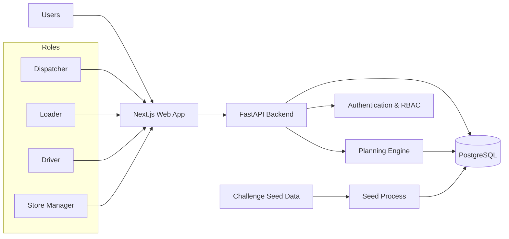
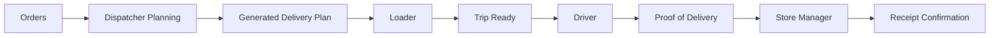
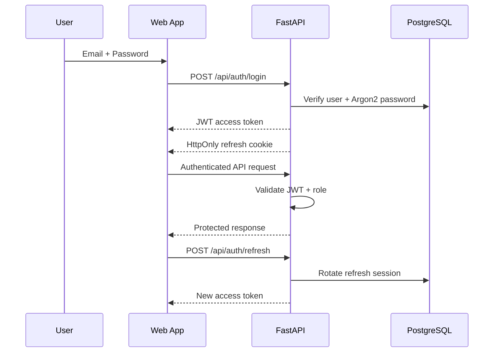

# Waypoint Pulse — System Architecture

Waypoint Pulse is a role-based logistics planning and execution platform connecting Dispatcher, Loader, Driver and Store Manager workflows.

## High-Level Architecture

## Technology Stack

**Frontend**
- Next.js
- React
- TypeScript
- Tailwind CSS

**Backend**
- FastAPI
- SQLAlchemy
- Python

**Database**
- PostgreSQL

**Authentication**
- Argon2 password hashing
- JWT access tokens
- Opaque refresh tokens
- HttpOnly refresh-token cookies
- Refresh-token rotation
- Role-based access control

**Infrastructure**
- Docker
- Docker Compose

## Operational Flow

## Planning Flow

The planning engine receives orders, outlets, vehicles, service allowances, district travel information, calendar data and fleet availability.

It applies constraints including:

- vehicle capacity
- volume capacity
- chilled requirements
- van-only access
- depot
- district
- vehicle trip limits
- operational time budgets
- order prioritization
- explicit deferral logic

The generated plan is persisted to PostgreSQL and then consumed by Loader and Driver workflows.

## Offline Driver Workflow

The Driver interface keeps required trip state locally.

If connectivity is unavailable:

1. delivery actions are queued locally
2. the Driver can continue the workflow
3. queued changes remain available
4. the application synchronizes queued actions when connectivity is restored

## Authentication Flow

## Role Isolation

Role-specific API operations are protected on the backend.

Examples:

- Dispatcher → planning and dashboard operations
- Loader → loading verification and Ready-state operations
- Driver → arrival, delivery and trip-completion operations
- Store Manager → store-delivery and receipt-confirmation operations

Frontend guards improve user experience, while backend RBAC provides the actual authorization boundary.