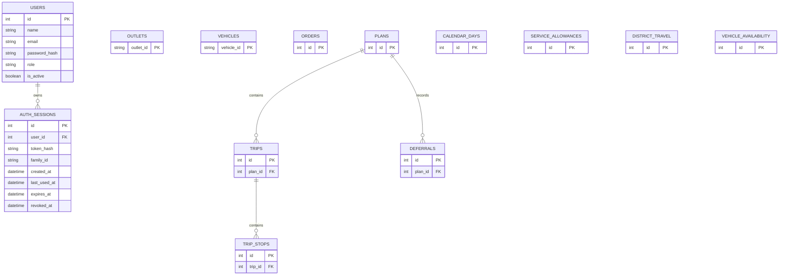

# Waypoint Pulse — Data Model

Waypoint Pulse uses PostgreSQL as its persistent data store.

## Main Entities



## Functional Groups

### Identity and Security

#### `users`

Stores the seeded operational users and their assigned application roles.

Main responsibilities:

- user identity
- email address
- Argon2 password hash
- assigned role
- active/inactive account status

The seeded roles are:

- Dispatcher
- Loader
- Driver
- Store Manager

#### `auth_sessions`

Stores refresh-session information used by the authentication system.

The database stores:

- user reference
- refresh-token hash
- token family identifier
- creation time
- last-used time
- expiry time
- revocation time

Raw refresh tokens are not stored in the database.

### Planning Inputs

#### `orders`

Stores delivery demand used by the planning engine.

Orders are treated as whole delivery units and are either:

- assigned to a trip, or
- explicitly deferred with a reason

#### `outlets`

Stores outlet information used when evaluating delivery feasibility and routing constraints.

Outlet information supports factors such as:

- district
- depot
- access characteristics
- delivery requirements

#### `vehicles`

Stores fleet information and vehicle capabilities.

Vehicle information is used for planning constraints such as:

- weight capacity
- volume capacity
- refrigerated capability
- van requirements
- depot assignment

#### `calendar_days`

Stores the operational calendar used by the planning workflow.

#### `service_allowances`

Stores service-time allowances used when calculating trip durations.

#### `district_travel`

Stores travel assumptions between depots and delivery districts.

The data includes information such as:

- depot-to-district distance
- free-flow travel time
- inter-stop distance
- inter-stop travel time
- road class

#### `vehicle_availability`

Stores vehicle availability information for the planning period.

### Planning Outputs

#### `plans`

Represents a generated delivery plan.

A plan acts as the parent record for:

- generated trips
- served orders
- deferred orders

#### `trips`

Represents a vehicle trip produced by the planning engine.

Each trip belongs to a generated plan. Trips are later consumed by the Loader and Driver workflows.

#### `trip_stops`

Represents the ordered delivery stops within a trip.

Trip stops are used throughout the operational flow, including:

- loading verification
- arrival updates
- delivery completion
- proof of delivery
- receipt confirmation

#### `deferrals`

Stores orders that could not be assigned to a valid trip.

Each deferral records an explainable reason so the Dispatcher can understand why the order was not included in the generated plan.

## Cross-Role Persistence

Planning and execution data is persisted in PostgreSQL rather than existing only in frontend state. This allows the same operational data to move across the complete workflow:

```text
Dispatcher
    ↓
Generated Plan
    ↓
Loader
    ↓
Ready Trip
    ↓
Driver
    ↓
Completed Delivery
    ↓
Store Manager
    ↓
Receipt Confirmation
```

Because the plan, trips and stops are persisted, each role works with the same underlying operational state.

## Authentication Relationship

A user may have multiple authentication sessions.

```text
User
  ├── Auth Session
  ├── Auth Session
  └── Auth Session
```

Refresh sessions can be individually revoked or revoked together when required.

## Fresh Database Initialization

On a clean PostgreSQL database, the seed process first creates the SQLAlchemy-defined tables and then inserts the challenge data and demo accounts.

The tested fresh installation creates:

| Table                | Rows   |
|----------------------|-------:|
| Users                | 4      |
| Outlets              | 120    |
| Vehicles             | 60     |
| Calendar rows        | 910    |
| Orders               | 92,307 |
| Service allowances   | 9      |
| District travel rows | 12     |
| Vehicle availability | 38     |

On later startups, existing records are detected so duplicate data is not inserted. For the large order dataset, the seed process detects existing orders and skips the full order import when the database has already been initialized.